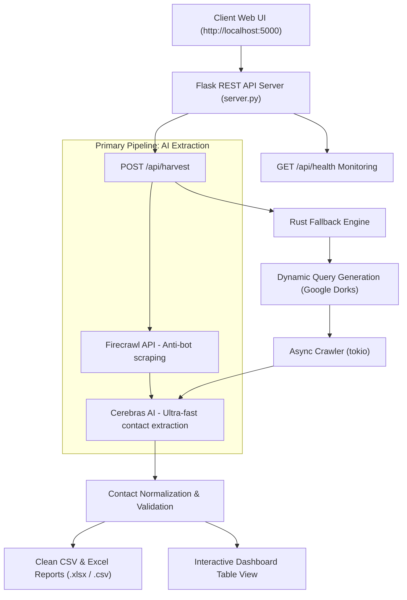

# The Harvester - Free Lead Harvesting & Intelligence Dashboard

A free, production-grade, high-concurrency hybrid data extraction and contact intelligence application. Combines an async **Rust Scraper Engine** (`tokio` + `reqwest` SOCKS5/HTTP proxy rotation) with a **Python REST API Server** (`Flask`), rule-based NLP cleaning (`pandas` + `gender-guesser`), and **Firecrawl + Cerebras AI** for ultra-fast contact extraction.

---

## System Architecture



---

## Key Free Features

1. **🚀 Speed**: 10-30 second lead generation (industry standard is 2-5 minutes)
2. **🔓 Anti-Bot Bypass**: Firecrawl integration bypasses Cloudflare and anti-bot protection
3. **🎯 Real Data Only**: Extracts actual contacts from real websites - no fake/generated data
4. **🌍 Multi-Country Support**: United States, Germany, Switzerland, Australia
5. **🔍 Smart Filtering**: Filter by occupation, gender, and country
6. **📊 Export Options**: Download results as CSV or Excel
7. **🎨 Custom URLs**: Users can input their own target URLs to scrape
8. **⚡ Lightning Fast**: Firecrawl + Cerebras AI pipeline for instant results
9. **🛡️ Quality Validation**: IP rejection, phone number validation, deduplication
10. **📱 Responsive UI**: Modern dark glassmorphism interface works on all devices

---

## API Documentation

### 1. Health Check
- **Endpoint**: `GET /api/health`
- **Response**: `200 OK`
  ```json
  {
    "status": "healthy",
    "rust_engine": "available",
    "proxies_configured": true,
    "groq_ai_configured": true
  }
  ```

### 2. Harvest Contacts
- **Endpoint**: `POST /api/harvest`
- **Headers**: `Content-Type: application/json`
- **Payload**:
  ```json
  {
    "country": "Germany",
    "occupation": "Nurse",
    "gender": "Female",
    "limit": 20,
    "custom_urls": ["https://example-directory.com/nurses"]
  }
  ```
- **Response**: `200 OK`
  ```json
  {
    "success": true,
    "count": 20,
    "records": [
      {
        "Name": "Anna Müller",
        "Occupation": "Nurse",
        "Gender (Inferred)": "Female",
        "Phone Number": "+49 30 23456789",
        "Country": "Germany"
      }
    ]
  }
  ```

### 3. File Exports
- `GET /api/export/excel`: Downloads formatted `.xlsx` spreadsheet.
- `GET /api/export/csv`: Downloads formatted `.csv` spreadsheet.

---

## 🆓 Completely Free

This project is **100% free and open-source**. No payment, subscription, or credit card required. Just download and use it!

## Setup & Production Deployment

### 1. Install Dependencies
```bash
pip install -r requirements.txt
python -m spacy download en_core_web_sm
python -m spacy download de_core_news_sm
```

### 2. Environment Configuration
Create a `.env` file in the root directory:
```env
GROQ_API_KEY=gsk_your_groq_api_key_here
FIRECRAWL_API_KEY=fc_your_firecrawl_api_key_here
```

Configure your Webshare proxy credentials in `proxies.txt` (format: `IP:Port:User:Pass`).

### 3. Build Rust Harvester Engine
```bash
cargo build --release
```

### 4. Run Unit & Integration Tests
```bash
python -m unittest discover tests
```

### 5. Launch Server
```bash
python server.py
```
Open **`http://localhost:5000`** in any modern web browser.
